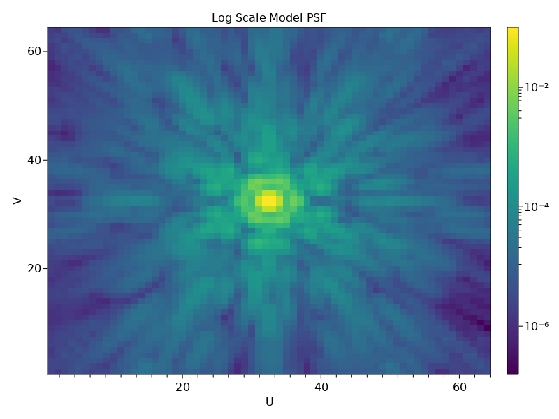
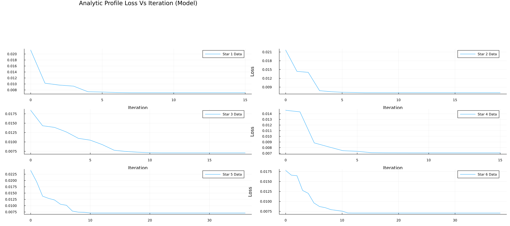
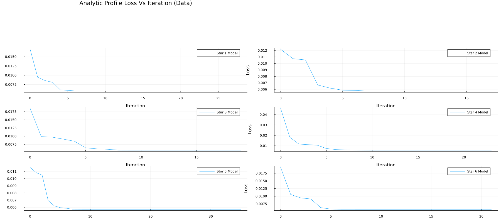
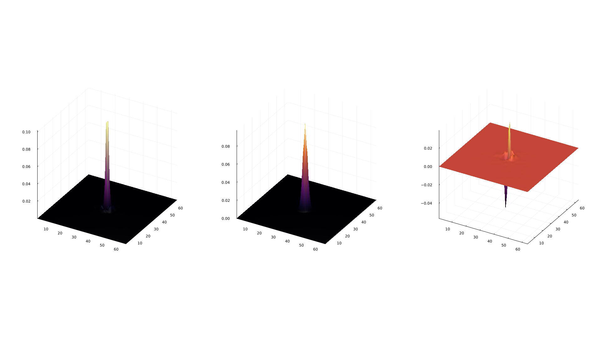
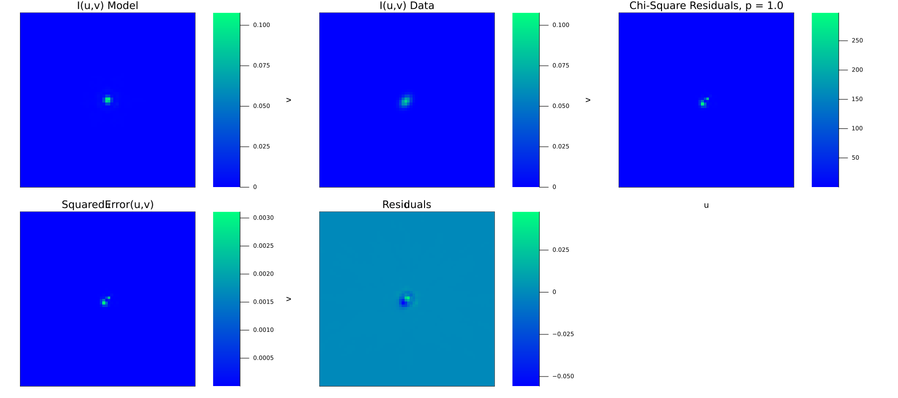
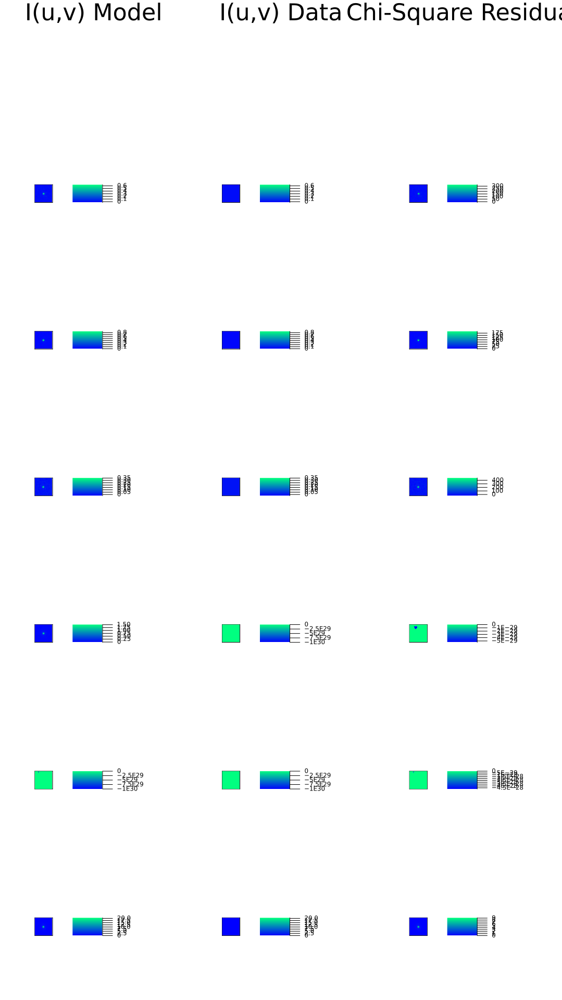
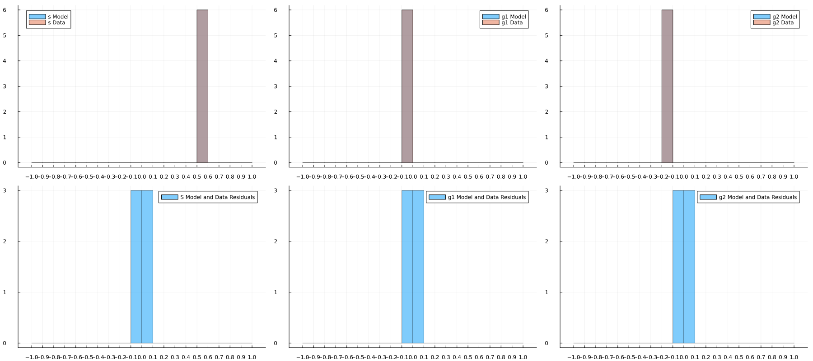
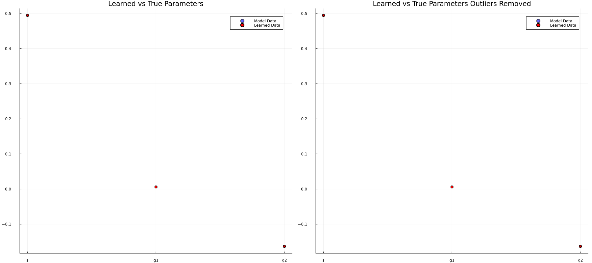
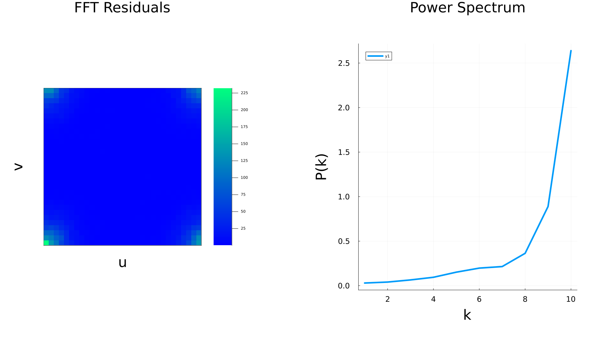
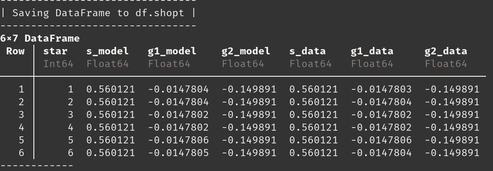

# shopt
## About
 [](https://github.com/EdwardBerman/shopt/blob/main/LICENSE) [](#contributors)

**Shear Optimization** with **Shopt.jl**, a julia library for empirical point spread function characterizations. We aim to improve upon the current state of Point Spread Function Modeling by using Julia to leverage performance gains, use a different mathematical formulation than the literature to provide more robust analytic fits, improve the diagnostic plots, and add features such as wavelets and shapelets. At this projects conclusion we will compare to existing software such as PIFF and PSFex. Work done under [McCleary's Group](https://github.com/mcclearyj).

## Inputs and Outputs
Currently, the inputs are perfect JWST Point Spread Functions generated by the webbpsf python package. The current outputs are images of these Point Spread Functions, Learned Analytic Fits, Learned Pixel Grid Fits, Residual Maps, Loss versus iteration charts, and p-value statisitcs. Not all functionality is working in its current state. Planned functionality for more Shear checkplots.

### Inputs
| Image      | Description         |
|------------|---------------------|
|   | Perfectly Simulated PSF by webbpsf |

### Outputs
| Image      | Description         |
|------------|---------------------|
|  | Loss versus iteration for matching analytic profile to the Model Star |
|   | Loss versus iteration for matching analytic profile to the Star Learned by a Pixel Grid Fit |
|  | 3D map to easily show where PSF is over and under subtracted |
|  | Analytic Profile fit for Model Star |
|  | Pixel Grid fit for Model Star |
|  | Histogram for learned profiles for each star in an analytic fit with their residuals |
|  | Same data recorded as a scatterplot with and without outliers removed and with error bars |
|  | The complex magnitude squared of each pixel of the fourier transform of the residual map side by side with the Power spectrum graph | 
|  | An image of the output .shopt file (a wrapper for a DataFrame turned into a CSV) | 

## Running
### Command
To run `shopt.jl`

Run ```julia shopt.jl [eventually the fits file you want to run] [configdir] [outdir] [datadir]```

### Dependencies
| Julia            | Python   |
|------------------|----------|
| Plots            | treecorr |  
| ForwardDiff      | astropy  |  
| LinearAlgebra    | webbpsf  |  
| Random           |          |  
| Distributions    |          |  
| SpecialFunctions |          |  
| Optim            |          |  
| IterativeSolvers |          |  
| QuadGK           |          |  
| PyCall           |          |
| DataFrames       |          |  
| CSV              |          |
| FFTW             |          |

### Set Up

## Program Architecture

tutorialNotebook.ipynb
> See for yourself how to run Shopt!

shopt.jl 
> A runner script for all functions in this software

dataPreprocessing.jl
> A wrapper for python code to handle fits files and dedicated file to deal with data cleaning and adding noise to test robustness of the software

dataOutprocessing.jl
> Convert data into a .shopt file. Access this data with readData()

plot.jl 
> A dedicated file to handle all plotting

radialProfiles.jl 
> Contains analytic profiles such as a Gaussian Fit and a kolmogorov fit

analyticCGD.jl 
> Provides the necessary arguments (cost function and gradient) to the optimize function for analytic fits 

pixelGridCGD.jl 
> Provides the necessary arguments (cost and gradient) to do a pixel grid Optimization

fluxNormalizer.jl 
> A function to determine A such that analytic profiles sum to unity

ellipticityNormalizer.jl 
> A function that maps the norm of a vector in Euclidean Space inside of an open ball, scales components appropriately such that g1 and g2 are in an open ball in 2d space

interpolate.jl 
> For Point Spread Functions that vary across the Field of View, interpolate.jl will fit a 3rd degree polynomial in u and v to show how each of the pixel grid parameters change across the ra and dec

outliers.jl 
> Contains two functions for identifying and removing outliers from a list

powerSpectrum.jl
> Computes the power spectra for a circle of radius k, called iteratively to plot P(k) / k

LICENSE
> MIT LICENSE

README.md
> User guide, Dependencies, etc.


## Known Issues
+ Need to take stamps of images to focus on the actual PSF 
+ Some Ploting Concerns with Size STD 
+ kolmogorov radial profile taking an unfeasible amount of time to compute
+ No current functionality for Rho statistics

## Contributors
+ Edward Berman
+ Jacqueline McCleary
