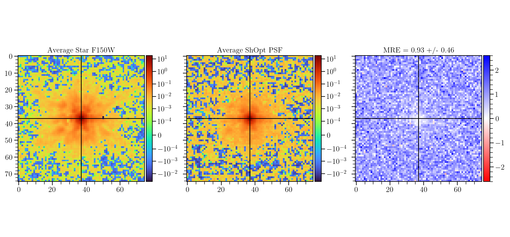
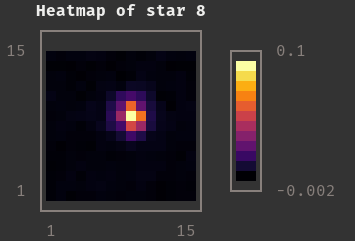
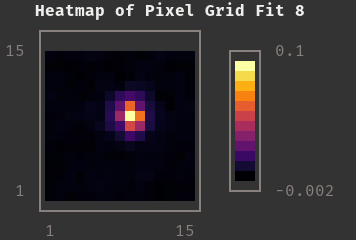

## **Table of Contents**
- **[About](#about)**
  - **[Who Should Use ShOpt](#who-should-use)**
  - **[Analytic Profile Fits](#analytic-profile-fits)**
  - **[Pixel Grid Fits](#pixel-grid-fits)**
  - **[Interpolation Across the Field of View](#interpolation-across-the-field-of-view)**
- **[Inputs and Outputs](#inputs-and-outputs)**
  - **[Inputs](#inputs)**
  - **[Outputs](#outputs)**
- **[Running](#running)**
  - **[Command](#command)**
  - **[Dependencies](#dependencies)**
  - **[Set Up](#set-up)**
  - **[Multi-Threading](#multithreading)**
  - **[Testing](#testing)**
- **[Program Architecture](#program-architecture)**
- **[How Can I Contribute?](#how-to-contribute)**
- **[Config / YAML Information](#config--yaml-information)**
- **[Known Issues](#known-issues-and-enhancements)**
- **[Contributors](#contributors)**
- **[Further Acknowledgements](#further-acknowledgements)**


## About
 [](https://github.com/EdwardBerman/shopt/blob/main/LICENSE) [](#contributors)

**Shear Optimization** with **ShOpt.jl**, a julia library for empirical point spread function characterizations. We aim to improve upon the current state of Point Spread Function Modeling by using Julia to leverage performance gains, use a different mathematical formulation than the literature to provide more robust analytic and pixel grid fits, improve the diagnostic plots, and add features such as wavelets and shapelets. At this projects conclusion we will compare to existing software such as PIFF and PSFex. Work done under **[McCleary's Group](https://github.com/mcclearyj)**.

Start by **Cloning This Repository**. Then see **TutorialNotebook.ipynb** or follow along the rest of this **README.md** to get started! Note that the commands in the tutorial notebook are meant to give a sense of procedure and can be executed with the Julia REPL itself.

### Who Should Use  
Users looking for empirical point spread function characterization software tailored for the data coming from the James Webb Space Telescope, or on a dataset with the similar characteristics. For example, the point spread function spans 100s of pixels because of the pixel scale of your camera, the point spread function is not well approximated by an analytic profile, or the point spread function varies alot across the field of view. For any of these reasons, you should consider using ShOpt.jl. ShOpt.jl is not a single function package, and we would encourage the user to explore the full functionality of ShOpt.jl in the sample config to tailor the software to their needs. 

**JWST Data is now publicly available at: [https://cosmos.astro.caltech.edu/page/cosmosweb-dr](https://cosmos.astro.caltech.edu/page/cosmosweb-dr)**. ShOpt was evaluated across all of the wavelengths in the 30mas pixel scale at this link.

### Analytic Profile Fits 

`ShOpt.jl`'s analytic profile fitting takes inspiration from a number of algorithms outside of astronomy, notably SE-Sync, an algorithm that solves the robotic mapping problem by considering the manifold properties of the data. With sufficiently clean data, the SE-Sync algorithm will descend to a global minimum constrained to the manifold $$SE(d)^n / SE(d)$$. Following suit, we are able to put a constraint on the solutions we obtain to $$[s, g_1, g_2]$$ to a manifold. The solution space to $$[s, g_1, g_2]$$  is constrained to the manifold $$B_2(r) \times \mathbb{R}_{+}$$. The existence of the constraint on shear is well known; nevertheless, the parameter estimation task is usually framed as an unconstrained problem. 

Path to [s, g_1, g_2] through cylindrical constraint.


### Pixel Grid Fits                                                                                                        

#### PCA Mode 
We used the first n weights of a Principal Component Analysis and use that to construct our PSF in addition to a smoothing kernel to account for aliasing

#### Autoencoder Mode
For doing Pixel Grid Fits we use an autoencoder model to reconstruct the Star
`PCA mode`
```Julia
function pca_image(image, ncomponents)    
  #Load img Matrix
  img_matrix = image

  # Perform PCA    
  M = fit(PCA, img_matrix; maxoutdim=ncomponents)    

  # Transform the image into the PCA space    
  transformed = MultivariateStats.transform(M, img_matrix)    

  # Reconstruct the image    
  reconstructed = reconstruct(M, transformed)    

  # Reshape the image back to its original shape    
  reconstructed_image = reshape(reconstructed, size(img_matrix)...)    
end    
```
`Autoencoder mode`
```Julia
# Encoder    
encoder = Chain(    
                Dense(r*c, 128, leakyrelu),    
                Dense(128, 64, leakyrelu),    
                Dense(64, 32, leakyrelu),    
               )    
#Decoder
decoder = Chain(    
                Dense(32, 64, leakyrelu),    
                Dense(64, 128, leakyrelu),    
                Dense(128, r*c, tanh),    
               )    
#Full autoencoder
autoencoder = Chain(encoder, decoder)    

#x_hat = autoencoder(x)    
loss(x) = mse(autoencoder(x), x)    

# Define the optimizer    
optimizer = ADAM()    

```


### Interpolation Across the Field of View
[s, g1, g2] are all interpolated across the field of view. Each Pixel is also given an interpolation across the field of view for an nth degree polynomial in (u,v), where n is supplied by the user


The plot on the left shows the average cutout of all stars in a supplied catalog. The plot     in the middle shows the average point spread function model for each star. The plot on the right show    s the average normalized error between the observed star cutouts and the point spread function model.

## Inputs and Outputs
Currently, the inputs are JWST Point Spread Functions source catalogs. The current outputs are images of these Point Spread Functions, Learned Analytic Fits, Learned Pixel Grid Fits, Residual Maps, Loss versus iteration charts, and p-value statisitcs. Not all functionality is working in its current state. Planned functionality for more Shear checkplots.

### Inputs 

| Image                             | Description                        |
|-----------------------------------|------------------------------------|
|   | Star Taken From Input Catalog      |
| shopt.yml                         | Config File for Tunable Parameters | 
| \* starcat.fits                   | Star Catalog to take  vignets from |

### Outputs

| Image                                              | Description                                                                                                                         |
|----------------------------------------------------|-------------------------------------------------------------------------------------------------------------------------------------|
| summary.shopt                                      | Fits File containing summary statistics and information to reconstruct the PSF                                                      |
|                     | Pixel Grid Fit for the Star Above                                                                                                   |
|                  | Residual Map for Above Model and Fit                                                                                                |
|                     | s varying across the field of view                                                                                                  |
|                    | g1 varying across the field of view                                                                                                 |
|                    | g2 varying across the field of view                                                                                                 |
|      | Histogram for learned profiles for each star in an analytic fit with their residuals                                                |
|    | Same data recorded as a scatterplot with and without outliers removed and with error bars                                           |

NB: This is not a comprehensive list, only a few cechkplots are presented. See the shopt.yml to configure which plots you want to see and save!

## Running
### Command 
To run `shopt.jl`

First use Source Extractor to create a catalog for ShOpt to accept and save this catalog in the appropriate directory

Run ```julia shopt.jl [configdir] [outdir] [catalog]```

There is also a shell script that runs this command so that the user may call shopt from a larger program they are running

### Dependencies 
Not all of these will be strictly necessary depending on the checkplots you produce, but for full functionality of ShOpt the following are necessary. Source Extractor (or Source Extractor ++) is also not a strict dependency, but in practice one will inevitably install to generate a catalog.

| Julia            | Python     | Binaries | Julia          | Julia          |
|------------------|------------|----------|----------------|----------------|
| Plots            | matplotlib | SEx      | ProgressBars   | BenchmarkTools |
| ForwardDiff      | astropy    |          | UnicodePlots   | Measures       |
| LinearAlgebra    | numpy      |          | CSV            | Dates          |
| Random           |            |          | FFTW           | YAML           |
| Distributions    |            |          | Images         | CairoMakie     |
| SpecialFunctions |            |          | ImageFiltering | Flux           |
| Optim            |            |          | DataFrames     | QuadGK         |
| IterativeSolvers |            |          | PyCall         | Statistics     |

### Set Up 
Start by cloning this repository. There are future plans to release ShOpt onto a julia package repository, but for now the user needs these files contents.

The dependencies can be installed in the Julia REPL. For example:
```julia
import Pkg; Pkg.add("PyCall")
```

We also provide dependencies.jl, which you can run to download all of the Julia libraries automatically by reading in the imports.txt file. Simply run `julia dependencies.jl` in the command line. For the three python requirements, you can similarly run `python dependenciesPy.py`. We also have a project enviornment for the Julia packages in the folder shopt\_env. It would be straightforward to add the line activate("shopt\_env") to the first line of shopt.jl to read in this environment. Note that Pycall would have to be built within this environment in some of the next steps.

For some functionality we need to use wrappers for Python code, such as reading in fits files or converting (x,y) -> (u,v). Thus, we need to use certain Python libraries. Thankfully, the setup for this is still pretty straightfoward. We use PyCall to run these snippets. 

There are four different methods to get Julia and Python to interopt nicely. We provide all of them as some of these methods play better with different systems.

First install the required Python libraries via pip (which is what `dependenciesPy.py` does). Now, for method 1, invoke the following in the julia REPL:

```julia
using PyCall
ENV["PYTHON"] = "/path_desired_python_directory/python_executable"; import Pkg; Pkg.build("PyCall")
pyimport("astropy")
```

Method 2. If you have a Conda Enviornment setup, you may find it easier to run 
```julia
using PyCall
pyimport_conda("astropy", "ap") #ap is my choice of name and astropy is what I am importing from my conda Enviornment
```

Method 3. julia also has a way of working with conda directly. Note that julia will create its own conda enviornment to read from.

```julia
using Conda
Conda.add("astropy", :my_env) #my conda enviornment is named my_env
```

You may also do `using Conda; Conda.add("astropy", "/path/to/directory")` or `using Conda; Conda.add("astropy", "/path/to/directory"; channel="anaconda")`

Method 4. On the off chance that none of these works, a final method may look like the following 
```julia
using PyCall
run(`$(PyCall.python) -m pip install --upgrade cython`)
run(`$(PyCall.python) -m pip install astropy`) 
```

After the file contents are downloaded the user can run ```julia shopt.jl [configdir] [outdir] [catalog]``` as stated above. Alternatively, they can run the shellscript that calls shopt in whatever program they are working with to create their catalog. For example, in a julia program you may use ```run(`./runshopt.sh [configdir] [outdir] [catalog]`)```

### Multithreading
Before running, we recommend that users run `export JULIA_NUM_THREADS=4` on Unix machines `set JULIA_NUM_THREADS=4` . By default Julia will run the program on a single thread, but the polynomial interpolation step is inherently parallelizable. The program is set to use all of threads available to it.  You may do more than 4, just be cautious about what your system can provide and when you start getting dimminishing returns.


### Testing
To test that everything works, running the `dependencies.jl` should test that everything is installed correctly in addition to downloading. Running 
```julia 
pyimport("astropy")
pyimport("matplotlib")
pyimport("numpy")
```
in the Julia REPL should ensure that Julia and Python are interopping correctly. 

Additionally, in the Julia REPL, we may write 
```julia
using Base.Threads
nthreads()
```
to make sure we are using 4 or more threads. The **TutorialNotebook.ipynb** will walk you through and test all of the functionality of the program. 

## Program Architecture

TutorialNotebook.ipynb
> Run ShOpt inside of a Jupyter Notebook and learn both how to run the program and how to reconstruct the PSF 

shopt.jl 
> A runner script for all functions in this software

dataPreprocessing.jl
> A wrapper for python code to handle fits files and dedicated file to deal with data cleaning 

dataOutprocessing.jl
> Convert data into a summary.shopt file. Access this data with reader.jl. Produces some additional python plots.

reader.jl
> Get Point Spread Functions at an arbitrary (u,v) by reading in a summary.shopt file 

plot.jl 
> A dedicated file to handle all plotting

radialProfiles.jl 
> Contains analytic profiles such as a Gaussian Fit and a kolmogorov fit

analyticLBFGS.jl 
> Provides the necessary arguments (cost function and gradient) to the optimize function for analytic fits 

pixelGridAutoencoder.jl
> Houses the function defining the autoencoder and other machine learning functions supplied to Flux's training call

interpolate.jl 
> For Point Spread Functions that vary across the Field of View, interpolate.jl will fit a nth degree polynomial in u and v to show how each of the pixel grid parameters change across the (u,v) plane

outliers.jl 
> Contains functions for identifying and removing outliers from a list

powerSpectrum.jl
> Computes the power spectra for a circle of radius k, called iteratively to plot P(k) / k

kaisserSquires.jl
> Computes the Kaisser-Squires array to be plotted

runshopt.sh
> A shell script for running Shopt. Available so that users can run a terminal command in whatever program they are writing to run shopt. 

LICENSE
> MIT LICENSE

README.md
> User guide, Dependencies, etc.

index.md
> For official website

_config.yml
> Also for official website

imports.txt
> List of Julia Libraries used in the program

packages.txt
> List of Python Libraries used in the program

dependencies.jl 
> Download all of the imports from imports.txt automatically

dependenciesPy.py 
> Download all of the imports from packages.txt automatically

## Config / YAML Information
saveYaml
- Set `true` if you want to save the YAML to the output directory for future reference, set to `false` otherwise

NNparams
- epochs
  - Set the Maximum Number of training epochs should the model never reach the minimum gradient of the loss function. Set to `1000` by default
- minGradientPixel
  - A stopping gradient of the loss function for a pixel grid fit. Set to `1e-6` by default

AnalyticFitParams
- minGradientAnalyticModel
  - A stopping gradient of the loss function for an analytic profile fit for input star vignets from a catalog. Set to `1e-6` by default
- minGradientAnalyticLearned
  - A stopping gradient of the loss function for an analytic profile fit     for stars learned by a pixel grid fit. Set to `1e-6` by default
- analyticFitStampSize
  - The box size for the subset of your stamp (see stamp size) you wish to use for analytic profile fitting. Ensure to specify this to be smaller than the stamp size of the vignets themselves. Set to `64` by default, therefore fitting an analytic profile to the middle `64 x 64` pixels of the stamp. 

dataProcessing
- SnRPercentile 
  - Supply a float that represents the percentile below which stars will be filtered by on the basis of signal to noise ratio. Set to `0.33` by default
- sUpperBound
  - Stars fit with an analytic profile are filtered out if their `s` exceeds this upper bound. Set to `1` by default
- sLowerBound
  - Stars fit with an analytic profile are filtered out if their `s` falls beneath this lower bound. Set to `0.075` by default
 
plots
- Set true to plot and save a given figure, false otherwise 

polynomialDegree
- The degree of the polynomial used to interpolate each pixel in the stamp across the field of view. Set to `3` by default

stampSize
- The size of the vignet for which use wish to fit. Used interpolation for oversampling and a simple crop for undersampling. Set to `131` by default to fit and interpolate `131 x 131` pixels

training_ratio
- Before doing a polynomial interpolation, the remaining stars will be divided into training and validation stars based off of this float. Set to `0.8` by default, indicating 80% training stars 20% validation stars

CommentsOnRun
- This is Where You Can Leave Comments or Notes To Self on the Run! Could be very useful if you save the yaml file with each run

## How to Contribute
Do one of the following:
+ Contact **berman.ed@northeastern.edu**
+ Fork this repository or submit a pull request

If you would like to report an issue or problem please raise an issue on this repository. If you would like to seek support, again see **berman.ed@northeastern.edu** . 
## Known Issues and Enhancements
+ We are working on more configurability in the YAML for a smoother user experience, however, everything in this repository is functional and ready to work out of the box
+ We are working on a chisq pixel grid fit mode. Right now the gain value g is hardcoded for chi square pixel grid fits

## Contributors
+ **[Edward Berman](https://edwardberman.github.io/EdwardBerman/)**
+ Jacqueline McCleary

With help from collaborators at COSMOS-Web: The JWST Cosmic Origins Survey

## Further Acknowledgements                                                                                                             
+ The **[Northeastern Cosmology Group](https://research.northeastern.edu/meet-northeasterns-new-astrophysics-professors-who-hope-to-shed-light-on-dark-matter-and-dark-energy/)** for Their Continued Support and Guidance                                                           
+ The **[Northeastern Physics Department](https://cos.northeastern.edu/physics/)** and **[Northeastern Undergraduate Research and Fellowships](https://undergraduate.northeastern.edu/research/)**, for making this project possible with funding from the Northeastern Physics Research Co-Op Fellowship and PEAK Ascent Award respectively   
+ **[David Rosen](https://github.com/david-m-rosen)**, who gave valuable input in the early stages of this project and during his course Math 7223, Riemannian Optimization
+ The **[COSMOS Web Collaboration](https://www.stsci.edu/jwst/science-execution/program-information?id=1727)** for providing data from the James Webb Space Telescope and internal feedback

## Cite 
Citation for the current **Journal of Open Source Software (JOSS)** preprint:
```
@misc{berman2023shoptjl,
      title={ShOpt.jl: A Julia Package for Empirical Point Spread Function Characterization of JWST NIRCam Data}, 
      author={Edward Berman and Jacqueline McCleary},
      year={2023},
      eprint={2310.00071},
      archivePrefix={arXiv},
      primaryClass={astro-ph.IM}
}
```
