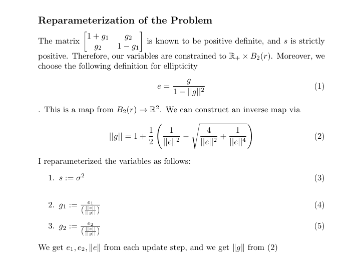
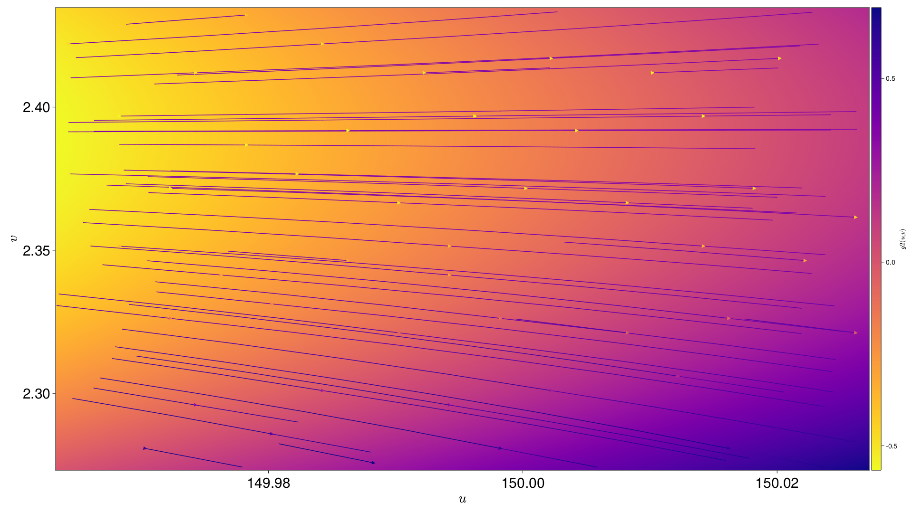
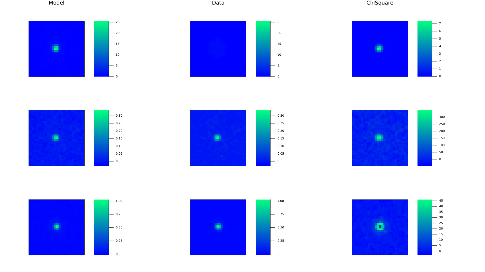

# Shopt Website!

| | [About](#about)  | [Inputs and Outputs](#inputs-and-outputs) | [Running](#running) | [Program Architecture](#program-architecture) | [Known Issues](#known-issues) | [Contributors](#contributors) | [Further Acknowledgements](#further-acknowledgements) |
|-|------------------|-------------------------------------------|---------------------|-----------------------------------------------|-------------------------------|-------------------------------|-------------------------------------------------------|
|(1) | [Analytic Profile Fits](#apf) | [Inputs](#inputs) | [Command](#cmd)| | | | |
|(2)| [Pixel Grid Fits](#pgf) | [Outputs](#outputs) | [Dependencies](#dpnd) | | | | |
|(3) |  | | [Set Up](#su) | | | | |
 


## About
 [](https://github.com/EdwardBerman/shopt/blob/main/LICENSE) [](#contributors)

**Shear Optimization** with **Shopt.jl**, a julia library for empirical point spread function characterizations. We aim to improve upon the current state of Point Spread Function Modeling by using Julia to leverage performance gains, use a different mathematical formulation than the literature to provide more robust analytic and pixel grid fits, improve the diagnostic plots, and add features such as wavelets and shapelets. At this projects conclusion we will compare to existing software such as PIFF and PSFex. Work done under [McCleary's Group](https://github.com/mcclearyj).

### Analytic Profile Fits {#apf}
We adopt the following procedure to ensure our gradient steps never take us outside of our constraints



### Pixel Grid Fits {#pgf}                                                                                           
For doing Pixel Grid Fits we use an autoencoder model to reconstruct the Star


## Inputs and Outputs
Currently, the inputs are JWST Point Spread Functions source catalogs. The current outputs are images of these Point Spread Functions, Learned Analytic Fits, Learned Pixel Grid Fits, Residual Maps, Loss versus iteration charts, and p-value statisitcs. Not all functionality is working in its current state. Planned functionality for more Shear checkplots.

### Inputs {#inputs}

| Image                             | Description                        |
|-----------------------------------|------------------------------------|
|   | Star Taken From Input Catalog      |


### Outputs {#outputs}

| Image                                              | Description                                                                                                                         |
|----------------------------------------------------|-------------------------------------------------------------------------------------------------------------------------------------|
|                     | Pixel Grid Fit for the Star Above                                                                                                   |
|                  | Residual Map for Above Model and Fit                                                                                                |
|                     | s varying across the field of view                                                                                                  |
|                    | g1 varying across the field of view                                                                                                 |
|                    | g2 varying across the field of view                                                                                                 |
|            | 3D map to easily show where PSF is over and under subtracted                                                                        |
|             | Pixel Grid fit for Model Star                                                                                                       |
|      | Histogram for learned profiles for each star in an analytic fit with their residuals                                                |
|    | Same data recorded as a scatterplot with and without outliers removed and with error bars                                           |
|             | The complex magnitude squared of each pixel of the Fourier transform of the residual map side by side with the Power spectrum graph |

## Running
### Command {#cmd}
To run `shopt.jl`

First use Source Extractor to create a catalog for Shopt to accept and save this catalog in the appropriate directory

Run ```julia shopt.jl [configdir] [outdir] [datadir]```

There is also a shell script that runs this command so that the user may call shopt from a larger program they are running

### Dependencies {#dpnd}
Not all of these will be strictly necessary depending on the checkplots you produce, but for full functionality of Shopt the following are necessary. Source Extractor is also not a strict dependency, but in practice one will inevitably install.

| Julia            | Python   | Binaries | Julia          |
|------------------|----------|----------|----------------|
| Plots            | treecorr | SEx      | ProgressBars   |
| ForwardDiff      | astropy  |          | UnicodePlots   |
| LinearAlgebra    | numpy    |          | CSV            |
| Random           |          |          | FFTW           |
| Distributions    |          |          | Images         |
| SpecialFunctions |          |          | ImageFiltering |
| Optim            |          |          | DataFrames     |
| IterativeSolvers |          |          | PyCall         |
| QuadGK           |          |          | Flux           |

### Set Up {#su}
The dependencies can be installed in the Julia REPL. For example:
```julia
import Pkg; Pkg.add("PyCall")
```

For some functionality we need to use wrappers for Python code, such as calculating rho statistics or reading in fits files. Thus, we need to use certain Python libraries. Thankfully, the setup for this is still pretty straightfoward. We use PyCall to run these snippets. If the Python snippets throw an error, run the following in the Julia REPL for each Python Library:          

```julia
using PyCall
pyimport("treecorr")
```
If you have a Conda Enviornment setup, you may find it easier to run 
```julia
using PyCall
pyimport_conda("treecorr", "tc") #tc is my choice of name and treecorr is what I am importing from my conda Enviornment 
```

On the off chance that none of these works, a final method may look like 
```julia
using PyCall
run(`$(PyCall.python) -m pip install --upgrade cython`)
run(`$(PyCall.python) -m pip install astropy`)
```

Once all dependencies are handled, the user now should clone this repository to obtain its file contents. There are future plans to release shopt onto the julia package repository, but for now the user needs these files contents.

After the file contents are downloaded the user can run ```julia shopt.jl [configdir] [outdir] [datadir]``` as stated above. Alternatively, they can run the shellscript that calls shopt in whatever program they are working with to create their catalog. For example, in a julia program you may use ```run(`./runshopt.sh [configdir] [outdir] [datadir]`)```

## Program Architecture

tutorialNotebook.ipynb
> See for yourself how to run Shopt!

shopt.jl 
> A runner script for all functions in this software

dataPreprocessing.jl
> A wrapper for python code to handle fits files and dedicated file to deal with data cleaning and adding noise to test robustness of the software

dataOutprocessing.jl
> Convert data into a .shopt file. Access this data with readData()

plot.jl 
> A dedicated file to handle all plotting

radialProfiles.jl 
> Contains analytic profiles such as a Gaussian Fit and a kolmogorov fit

analyticCGD.jl 
> Provides the necessary arguments (cost function and gradient) to the optimize function for analytic fits 

pixelGridCGD.jl 
> Provides the necessary arguments (cost and gradient) to do a pixel grid Optimization

fluxNormalizer.jl 
> A function to determine A such that analytic profiles sum to unity

ellipticityNormalizer.jl 
> A function that maps the norm of a vector in Euclidean Space inside of an open ball, scales components appropriately such that g1 and g2 are in an open ball in 2d space

interpolate.jl 
> For Point Spread Functions that vary across the Field of View, interpolate.jl will fit a 3rd degree polynomial in u and v to show how each of the pixel grid parameters change across the ra and dec

outliers.jl 
> Contains two functions for identifying and removing outliers from a list

powerSpectrum.jl
> Computes the power spectra for a circle of radius k, called iteratively to plot P(k) / k

kaisserSquires.jl
> Computes the Kaisser-Squires array to be plotted

runSourceExtractor.jl
> Runs Sex on input .fits file supplied in datadir 

runshopt.sh
> A shell script for running Shopt. Available so that users can run a terminal command in whatever program they are writing to run shopt. 

LICENSE
> MIT LICENSE

README.md
> User guide, Dependencies, etc.

index.md
> For official website

_config.yml
> Also for official website

## Known Issues
+ Need to take stamps of images to focus on the actual PSF 
+ Some Ploting Concerns with Size STD 
+ kolmogorov radial profile taking an unfeasible amount of time to compute
+ No current functionality for Rho statistics

## Contributors
+ Edward Berman
+ Jacqueline McCleary

## Further Acknowledgements
+ The Northeastern Cosmology Group for Their Continued Support and Guidance
+ The Northeastern Physics Department and Northeastern Undergraduate Research and Fellowships, for making this project possible with funding from the Northeastern Physics Co-Op Fellowship and PEAK Ascent Award respectively
+ [David Rosen](https://github.com/david-m-rosen), who gave valuable input in the early stages of this project and during his course Math 7223, Riemannian Optimization
