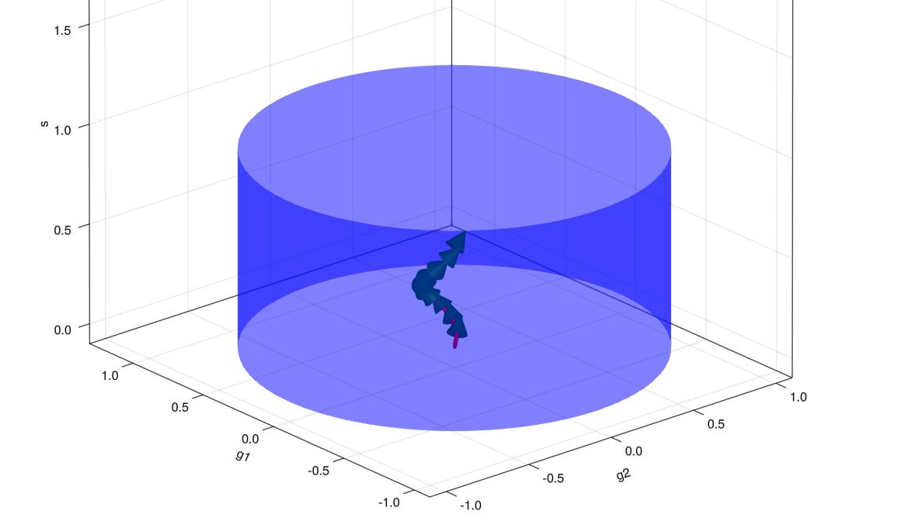
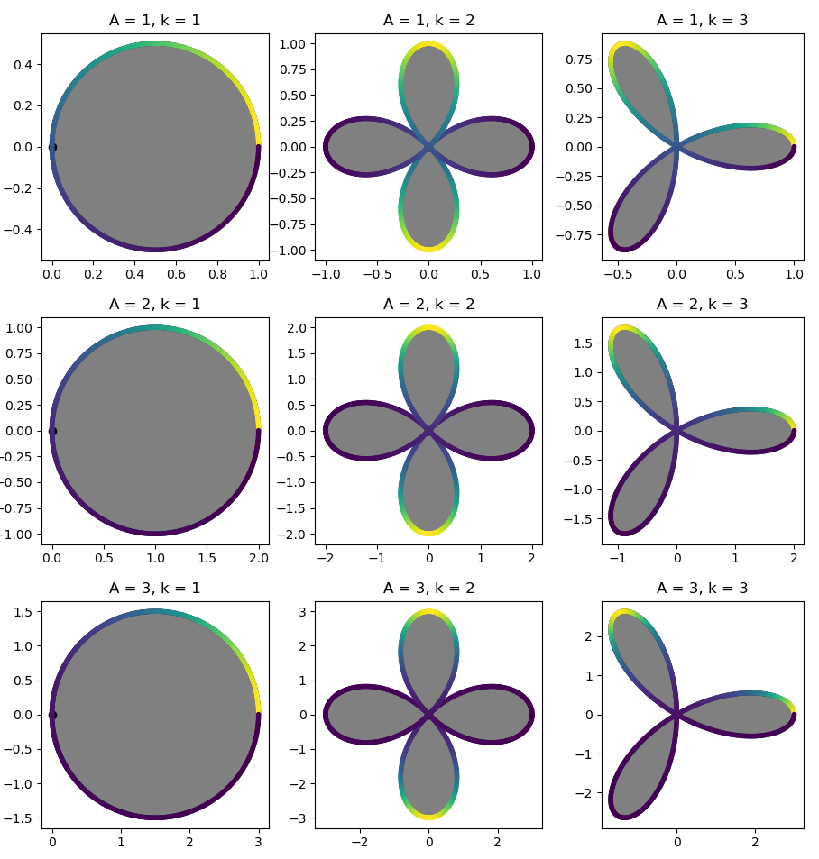

# Summary
## Introduction
When astronomers image the night sky, the path of the incoming light has been altered by diffraction, optical aberrations, atmospheric turbulence, and telescope jitter. These effects are summarized in the image's point spread function (PSF), a mathematical model that describes the response of an optical system to an idealized point of light. Because the PSF can resemble or obscure the signal of interest, it must be carefully modeled to extract the maximum amount of information from an observation. Failing to do so can lead to inaccuracies in positions, sizes, and shapes of targets like galaxies.

The goal of PSF characterization is to be able to point to any position on your camera and predict what the distortion looks like. Once we have a model that can do this well, we can deconvolve the PSF to produce images free of distortion.

  The PSF characterization methods used by astronomers fall into two main classes: forward-modeling approaches, which use physical optics propagation based on models of the optical array, and empirical approaches, which use stars as fixed points to model and interpolate the PSF across the rest of the image. (Stars are essentially point sources before their light passes through the atmosphere and telescope, so the shape and size of their surface brightness profiles axiomatically define the PSF at that location.) Empirical PSF characterization proceeds by first cataloging the observed stars, separating the catalog into validation and training samples, and interpolating the training stars across the field of view of the camera. We use the term vignettes to describe the image stamps containing stars that make up the catalog. After training, the PSF model can be validated by comparing the reserved stars to the PSF model's prediction.

Shear Optimization with `ShOpt.jl` introduces modern techniques for empirical PSF characterization across the field of view that are tailored to James Webb Space Telescope (JWST) imaging. ShOpt has two modes of operation: approximating stars with analytic profiles, and a more realistic pixel-level representation.

## Analytic profile mode
A rough idea of the size and shape of the PSF can be obtained by fitting stars with analytic profiles. We adopt a multivariate Gaussian profile because it is computationally cheap to fit to an image. That is, it is easy to differentiate and doesn't involve any numeric integration or other costly steps to calculate. Fitting other common models, such as a Kolmogorov profile, involves numeric integration and thus take much longer to fit. Moreover, the JWST point spread function is very "spikey" (cf. Figure 1). As a result, analytic profiles are limited in their ability to model the point spread function anyway, making the usual advantages of a more expensive analytic profile moot.   


Our multivariate gaussian is parameterized by three variables, $[s, g_1, g_2]$, where $s$ corresponds to size and $g_1 , g_2$ correspond to shear. A shear matrix has the form $$\begin{pmatrix}
1 + g_1 & g_2 \\
g_2 & 1 - g_1
\end{pmatrix}
$$. Given a point $[u, v]$, we obtain coordinates $[u' , v']$ by applying a shear and then a scaling by $\frac{s}{\sqrt{1 - g_1^2 - g_2^2}}$. Then, we choose $f(r) :=  Ae^{-r^2}$ to complete our fit, where $A$ makes the fit sum to unity over the cutout of our star. After we fit this function to our stars with `Optim.jl` [@Mogensen2018] and `ForwardDiff.jl` [@RevelsLubinPapamarkou2016], we interpolate the parameters across the field of view according to position. Essentially, each star is a datapoint, and the three variables are treated as polynomials in focal plane coordinates $(u,v)$ of degree $n$, where $n$ is supplied by the user. The focal plain refers to the set of points where an image appears to be in perfect focus. The units of focal plane coordinates are arcseconds. This is instead of pixel coordinates, where one just uses (x,y) as measured on an image. For a more precise model, we also give each pixel in our star stamp a polynomial and interpolate it across the field of view. That is, each pixel in position $(i,j)$ of a star cutout gets its own polynomial, interpolated over $k$ different star cutouts at different locations in the focal plane. This is referred to in the literature as a pixel basis [@Jarvis_2020].

### Notation
1. For the set $B_2(r)$, we have:

   $$
   B_2(r) \equiv \{ [x,y] : x^2 + y^2 < 1 \} \subset \mathbb{R}^2
   $$

2. For the set $\mathbb{R}_+$, we have:

   $$
   \mathbb{R}_+ \equiv \{ x : x > 0 \} \subset \mathbb{R}
   $$

3. For the Cartesian product of sets $A$ and $B$, we have:

   $$
   A \times B \equiv \{(a, b): a \in A, b \in B \}
   $$

### Analytic methods
`ShOpt.jl`'s analytic profile fitting takes inspiration from a number of algorithms outside of astronomy, notably SE-Sync [@doi:10.1177/0278364918784361], an algorithm that solves the robotic mapping problem by considering the manifold properties of the data. With sufficiently clean data, the SE-Sync algorithm will descend to a global minimum constrained to the manifold $SE(d)^n / SE(d)$. Following suit, we are able to put a constraint on the solutions we obtain to $[s, g_1, g_2]$ to a manifold. The solution space to $[s, g_1, g_2]$  is constrained to the manifold $B_2(r) \times \mathbb{R}_{+}$ [@Bernstein_2002]. While it was known that this constrain existed in the literature, the parameter estimation task is generally framed as an unconstrained problem  [@Jarvis_2020]. For a more rigorous treatment of optimization on manifolds see [@AbsMahSep2008] and [@boumal2023intromanifolds]. `Julia` has lots of support for working with manifolds with `Manopt`, which we may leverage in future releases [@Bergmann2022].



## Pixel grid mode
`ShOpt.jl` provides two modes for pixel grid fits, `PCA mode` and `Autoencoder mode`. `PCA mode`, outlined below, reconstructs its images using the first $n$ principal components. `Autoencoder mode` uses a neural network to reconstruct the image from a lower dimensional latent space. The network code written with `Flux.jl` is also outlined below [@innes:2018]. Both modes provide the end user with tunable parameters that allow for both perfect reconstruction of star cutouts and low dimensional representations. The advantage of these modes is that they provide good reconstructions of the distorted images that can learn the key features of the point spread function without overfitting the background noise. In this way it generates a datapoint for our algorithm to train on and denoises the image in one step. In both cases, the input star data is cleaned by first fitting an analytic (Gaussian) PSF profile and rejecting size outliers.  

### Pixel methods

`PCA mode`
```Julia
function pca_image(image, ncomponents)    
  #Load img Matrix
  img_matrix = image

  # Perform PCA    
  M = fit(PCA, img_matrix; maxoutdim=ncomponents)    

  # Transform the image into the PCA space    
  transformed = MultivariateStats.transform(M, img_matrix)    

  # Reconstruct the image    
  reconstructed = reconstruct(M, transformed)    

  # Reshape the image back to its original shape    
  reconstructed_image = reshape(reconstructed, size(img_matrix)...)    
end    
```
`Autoencoder mode`
```Julia
# Encoder    
encoder = Chain(    
                Dense(r*c, 128, leakyrelu),    
                Dense(128, 64, leakyrelu),    
                Dense(64, 32, leakyrelu),    
               )    
#Decoder
decoder = Chain(    
                Dense(32, 64, leakyrelu),    
                Dense(64, 128, leakyrelu),    
                Dense(128, r*c, tanh),    
               )    
#Full autoencoder
autoencoder = Chain(encoder, decoder)    

#x_hat = autoencoder(x)    
loss(x) = mse(autoencoder(x), x)    

# Define the optimizer    
optimizer = ADAM()    

```

# Statement of need
We can trace the first empirical PSF fitters back to DAOPHOT [@Stetson_1987]. `PSFex` made major advancements in precise PSF modeling. With `PSFex`, you could interpolate several different bases, including a basis of pixels, instead of relying on simple parametric functions. `PSFex` was built as a general purpose tool and to this day is widely used. Newer empirical PSF fitters are geared toward large scale surveys and the difficulties that arise specific to those datasets. As an example, The Dark Energy Survey and DESCam [@Jarvis_2020;@2015AJ] sparked the creation of `PIFF`. The recent data from the James Webb Space Telescope poses new challenges.

(1) The JWST PSFs are not well approximated by analytic profiles as seen in Figure 1. This calls for well thought out parametric free models that can capture the full dynamic range of the Point Spread Function without fixating on the noise in the background. Previously, Rowe statistics and other parametic equations were used to diagnose PSF accurarcy [@Barnaby2010MNRAS]. `ShOpt` provides a suite of parametric free summary statistics out of the box.

(2) The NIRCam detectors are 0.03"/pix or 0.06" /pix  [@10.1117/12.489103; @BSPIE; @20052005SPIE]. To capture an accurate description of the point spread function at this scale we need images that are $131$ by $131$ to $261$ by $261$ pixels across. These vignette sizes are much larger in comparison to the sizes needed for previous large surveys such as DES [@Jarvis_2020] and SuperBIT [@mccleary2023lensing] and forces us to evaluate how well existing PSF fitters scale to this size. The DES and SuperBIT surveys needed PSF sizes of $17$ by $17$ and $48$ by $48$, an order of magnitude less than the JWST PSF sizes.


# State of the Field
There are several existing empirical PSF fitters in addition to a forward model of the JWST PSFs developed by STScI [@Jarvis_2020 ; @2011ASPC; @2014SPIE ; @2012SPIE]. We describe them here and draw attention to their strengths and weaknesses to motivate the development of `ShOpt.jl`. As described in the statement of need, `PSFex` was one of the first precise and general purpose tools used for empirical PSF fitting. However, `PSFex` produced a systematic size bias of the point spread function with how it calculated spatial variation across the field of view [@Jarvis_2020]. It was discovered via the analytic profile fits that the size of the point spread function, governed by the variable $[s]$, was underestimated.

`PIFF` (Point Spread Functions in the Full Field of View) followed `PSFex` in the effort to correct this issue. The DES camera was $2.2$ degrees across, which was large enough for the size bias to become noticable for their efforts. `PIFF` works in focal plane coordinates as opposed to pixel coordinates which fixes the systematic size bias. Jarvis and DES also used the `Python` libraries of astropy [@2022ApJ] and Galsim [@rowe2015galsim] to make the software more accessible than PSFex to programmers in the astrophysics community. PSFex was written in `C` and has been active for more than 20 years. Due to being so old and written in a low level language it is much less approachable for a community of open source developers. One of the motivations of `ShOpt` was to write astrophysics specific software in `Julia`, because `Julia` provides a nice balance of readability and speed with it's high level functional paradigm and just in time compiler. `ShOpt` works directly in sky coordinates, which minimizes any bias that might be introduced by transformation from pixel to sky coordinates afterwords.

While we do have forwards models of the JWST PSF, these models are for single exposure images. The JWST images are either single exposure or mosaics [@2014SPIE; @2012SPIE]. Mosaiced images are essentially single exposure detector images averaged together. To account for the rotation of the camera between the capture of images and the wide field of view, there are a number of steps that make applying these forward models to mosaics a non trivial procedure. There is also some recent work being done to generate hybrid models for single exposure data [@lin2023hybpsf]. Hybrid models take these forward models and add an empirical correction. At present, there is yet to be any widely available software to do this.  

The COMOS-Web survey is the largest JWST extragalactic survey according to area and prime time allocation [@casey2023cosmosweb], and takes up $0.54 ~deg^2$ [@10.1117/12.925447; @Rieke_2023]. This is a large enough portion of the sky that we should prepare to see a lot of variation across the field of view. This gives `ShOpt` the oppurtunity to validate PIFF's correction for handling PSF variations and test how impactful (or not impactful) PSFex's size bias is.

# Future Work
We speculate that petal diagrams may be able to approximate the spikey natures of JWST PSFS. Consider $r = A \cos(k\theta + \gamma)$, shown below in figure 3 for different $[A, k]$ values where $\gamma = 0$. In practice, $[A, k, \gamma]$ could be learnable parameters. Moreover, we could do this for a series of trigonmetric functions to get petals of different sizes. We could then choose some $f(r) \propto \frac{1}{r}$ such that the gray fades from black to white. We would define $f(r)$ piece wise such that it is $0$ outside of the petal and decreases radially with $r$ inside the petal.



# Acknowledgements
This material is based upon work supported by a Northeastern University Undergraduate Research and Fellowships PEAK Experiences Award. We would also like to thank the Northeastern Physics Department for making this project possible through the Physics Co-op Research Fellowship. Support for COSMOS-Web was provided by NASA through grant JWST-GO-01727 and HST-AR-15802 awarded by the Space Telescope Science Institute, which is operated by the Association of Universities for Research in Astronomy, Inc., under NASA contract NAS 5-26555. This work was made possible by utilizing the CANDIDE cluster at the Institut d’Astrophysique de Paris. Finally, we would like to thank Northeastern Research Computing for access to their servers. Additionally, we'd like to extend a thank you to Professor David Rosen for giving some valuable insights during the early stages of this work.

# References
