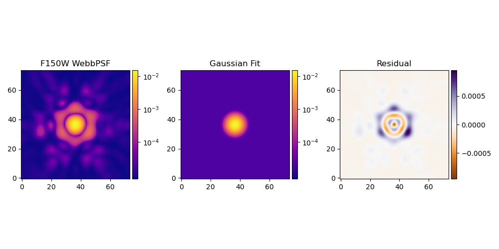

# Summary

When astronomers capture images of the night sky, several factors -- ranging from diffraction and optical aberrations to atmospheric turbulence and telescope jitter -- affect the incoming light. The resulting distortion and blurring are summarized in the image's point spread function (PSF), the response of an optical system to an idealized point source. The PSF can obscure or even mimic the astronomical signal of interest, making its accurate characterization essential.  By effectively modeling the PSF, we can predict image distortions at any location and proceed to deconvolve the PSF, ultimately reconstructing distortion-free images.

The PSF characterization methods used by astronomers fall into two main classes: forward-modeling approaches, which use physical optics propagation based on models of the optics, and empirical approaches, which use stars as fixed points to model and interpolate the PSF across the rest of the image. (Stars are essentially point sources before their light passes through the atmosphere (when observing from the ground) and telescope, so the shape and size of their surface brightness profiles define the PSF at that location.) Empirical PSF characterization proceeds by first cataloging the observed stars, separating the catalog into validation and training samples, and interpolating the training stars across the field of view of the camera. After training, the PSF model can be validated by comparing the reserved stars to the PSF model's prediction.

Shear Optimization with `ShOpt.jl` introduces modern techniques, tailored to James Webb Space Telescope (JWST) NIRCam imaging, for empirical PSF characterization across the field of view. ShOpt has two modes of operation: approximating stars with analytic profiles, and a more realistic pixel-level representation. Both modes take as input a catalog with image cutouts -- or "vignettes" -- of the stars targeted for analysis. 

# Statement of need
Empirical PSF characterization tools like Point Spread Function Extractor (PSFEx [@2011ASPC]) and Point Spread Functions in the Full Field of View (PIFF [@Jarvis_2020]) are widely popular in astrophysics. However, the quality of PIFF and PSFEx models tends to be quite sensitive to the parameter values used to run the software, with optimization sometimes relying on brute-force guess-and-check runs. PIFF is also notably inefficient for large, well-sampled images, taking hours in the worst cases. The JWST's Near Infrared Camera (NIRCam) offers vast scientific opportunities (e.g. [@casey2023cosmosweb]); at the same time, this unprecedented data brings new challenges for PSF modeling:

(1) Analytic functions like Gaussians are incomplete descriptions of the NIRCam PSF, as evident from Figures 1 and 2. Figure 1 shows that to get a good PSF model we need to model a large dynamic range over a large box size. Figure 2 illustrates that the residuals between an idealized forward model and a Gaussian approximation can be quite severe. This calls for well-thought-out, non-parametric modeling and diagnostic tools that can capture the full dynamic range of the NIRCam PSF. `ShOpt` provides these models and diagnostics out of the box.

(2) The NIRCam detectors have pixel scales of 0.03 (short wavelength channel) and 0.06 (long wavelength channel) arcseconds per pixel [@10.1117/12.489103; @BSPIE; @20052005SPIE]. At these pixel scales, star vignettes need to be at least $131$ by $131$ pixels across to fully capture the wings of the PSFs (4-5 arcseconds). These vignette sizes are 3-5 times larger than the ones used in surveys such as DES [@Jarvis_2020] and SuperBIT [@10.3847/1538-3881/ace7ca] and force us to evaluate how well existing PSF fitters scale to this size. `ShOpt` has been designed for computational efficiency and aims to meet the requirements of detectors like NIRCam.  

`ShOpt` bridges the speed of `PSFex` with the features of `PIFF` using fewer configurable hyperparameters. `ShOpt` employs a number of techniques to optimize the speed of the program. First and foremost, `ShOpt` is equipped with support for multithreading. Polynomial interpolation is used for handling PSF variations across the field of view. The polynomials given to each basis element of the PSF are independent of one another and therefore can be distributed to different CPU threads to be run in parallel. `ShOpt` also introduces new methods for fitting both analytic profiles and pixel based profiles. If an analytic profile is used to model the PSF, then there are $3$ basis elements parameterizing the model. We choose 2D elliptical Gaussians for these analytic profiles because they are cheap to compute. Moreover, we use the Limited Memory Broyden–Fletcher–Goldfarb–Shanno algorithm (LBFGS) to find these paramters. This is faster but more memory intensive than Conjugate Gradient, the algorithm used in `PIFF`. Moreover, the $3$ basis elements are constrained to the manifold $B_2(r) \times \mathbb{R}_+$, where $B_2(r) = \{ (x,y) : x^2 + y^2 < 1 \}$ and $\mathbb{R}_+ = \{ x : x > 0 \}$. We constructed a function that maps any point in $\mathbb{R}^3$ into $B_2(r) \times \mathbb{R}_+$. The LBFGS algorithm uses successive iterations to converge to a solution for the $3$ basis elements, and so we use this function to ensure that our update steps in LBFGS do not leave the constraint. For the pixel basis, both `PIFF` and `PSFex` approximate the PSF by minimizing the reduced $\chi^2$ between a grid of pixels and a star vignette. PCA can quickly achieve the same purpose of approximating the input vignette without overfitting to background noise. We also provide an autoencoder mode, which uses deep learning to reconstruct the image. The weights and biases are not reset between stars, so the knowledge of how to reconstruct one star is transfered to the next. This in turn leads to fewer training iterations. Finally, `ShOpt` is written in Julia. Julia uses a just in time compiler which makes it faster than intepreted languages such as Python and has shown to be a good choice for performance critical code [@Stanitzki_2021]. 

# State of the Field
The JWST captures images at high resolution and at wavelengths of light that have been previously unexplored [@Gardner_2006]. With these images we are seeing farther into the early universe than we ever have before. The difficulties of producing good PSF models for the JWST are emblematic of a larger problem: Our data sets are getting bigger and existing software was not built to scale. That is to say, the advancements in software are falling behind the advances in instrumentation. Not only does `ShOpt` produces PSF models for JWST NIRCam images, it also sets the precedent for designing software that scales.  

There are several existing empirical PSF fitters, in addition to a forward model of the JWST PSFs developed by STScI [@Jarvis_2020 ; @2011ASPC; @2014SPIE ; @2012SPIE]. We describe them here and draw attention to their strengths and weaknesses to further motivate the development of `ShOpt.jl`. As described in the statement of need, `PSFex` was one of the first precise and general purpose tools used for empirical PSF fitting. However, the Dark Energy Survey collaboration reported small but noticeable discrepancies between the sizes of `PSFex` models and the sizes of observed stars. They also reported ripple-like patterns in the spatial variation of star-PSF residuals across the field of view [@Jarvis_2020], which they attributed to the astrometric distortion solutions for the Dark Energy Camera.

These findings motivated the Dark Energy Survey's development of `PIFF` (Point Spread Functions in the Full Field of View). `PIFF` works in sky coordinates on the focal plane, as opposed to image pixel coordinates used in `PSFex`, which minimized the ripple patterns in the star-PSF residuals and the PSF model size bias. (Based on the DES findings, `ShOpt` also works directly in sky coordinates.) `PIFF` is written in Python, a language with a large infrastructure for astronomical data analysis, for example Astropy [@2022ApJ] and Galsim [@rowe2015galsim]. The choice of language makes `PIFF` software more accessible to programmers in the astrophysics community than `PSFex`, which was first written in `C` in 2007 and much less approachable for a community of open source developers. One of the motivations of `ShOpt` was to write astrophysics specific software in `Julia`, because `Julia` provides a good balance of readability and speed with its high-level functional paradigm and just-in-time compiler [@Stanitzki_2021]. Julia ranks behind Python, IDL, Matlab, and Fortran in full-text mentions in astronomical literature [@TheAstropyCollaboration_2022]. We are optimistic that `ShOpt` will demonstrate that Julia is an appealing choice for programming in astronomy despite its low adoption to date. There is also recent work on using `PSFr` for PSF reconstructions that has been applied to JWST data [@2022ApJ939L28D; @2022ApJ938L17Y; @2022ApJ938L14M; @2023ApJ942L27S]. Similar to `ShOpt`, `PSFr` begins its PSF modeling by stacking stars to form an initial guess. However, rather than using polynomial interpolation to address spatial variations, `PSFr` employs an iterative process of shifting the pixels in its PSF model. This process continues until the model can adequately represent all of the stars in the catalog. Finally, the PSF fitter `STARRED` [@michalewicz2023starred] has been shown to produce PSF models competitive with `PSFr` and `PSFex`. Like `ShOpt`, `STARRED` puts an emphasis on computational efficiency and uses the JAX package [@schoenholz2019jax] to achieve just-in-time compilation. There is future work to be done to benchmarking all of these empirical approaches on JWST NIRCam data. 

While WebbPSF provides highly precise forward models of the JWST PSF, these models are defined for single-epoch exposures [@2012SPIE; @2014SPIE]. Much of the NIRCam science is accomplished with image mosaics -- essentially, the combination of single exposure detector images into a larger, deeper image. The rotation of the camera between exposures, the astrometric transformations and resampling of images before their combination into a mosaic, and the mosaic's large area all make the application of WebbPSF models to mosaics a non-trivial procedure. This has been done quite effectively [@ji2023jades], however, it is not as easy to reproduce compared to running an empirical characterization tool like `ShOpt`.  

As outlined in the state of the field, `ShOpt` is a tool built with the user experience in mind that attempts to bridge the strengths of existing PSF fitters. `ShOpt`'s combination of speed, user friendliness, and accuracy enable the science goals of the COSMOS-Web survey, detailed below.

The COMOS-Web survey is the largest cycle 1 JWST extragalactic survey according to area and prime time allocation [@casey2023cosmosweb], and covers $0.54 ~deg^2$ [@BSPIE; @Rieke_2023]. Among other science goals, the COMOS-Web survey will use the JWST to detect thousands of galaxies in the Epoch of Reionization $(6 ∼ z ∼ 11)$ to create one of the highest resolution large scale structure maps of the early universe [@casey2023cosmosweb]. JWST data has also been used to pick out active galactic nuclei from host galaxies [@zhuang2023characterization] and indentify $15$ candidate galaxies whose luminosities push the limits of our $\Lambda$CDM galaxy formation models [@franco2023cosmosweb]. These science cases all rely upon good PSF modeling and underscore the importance of `ShOpt`.

# Acknowledgements
This material is based upon work supported by a Northeastern University Undergraduate Research and Fellowships PEAK Experiences Award. E.B. was also supported by a Northeastern University Physics Department Co-op Research Fellowship. Support for COSMOS-Web was provided by NASA through grant JWST-GO-01727 and HST-AR-15802 awarded by the Space Telescope Science Institute, which is operated by the Association of Universities for Research in Astronomy, Inc., under NASA contract NAS 5-26555. This work was made possible by utilizing the CANDIDE cluster at the Institut d’Astrophysique de Paris. Further support was provided by Research Computers at Northeastern University. Additionally, E.B. thanks Professor David Rosen for giving some valuable insights during the early stages of this work. The authors gratefully acknowledge the use of simulated and real data from the COSMOS-Web survey in developing ShOpt, as well as many conversations with COSMOS-Web scientists. 

# References
